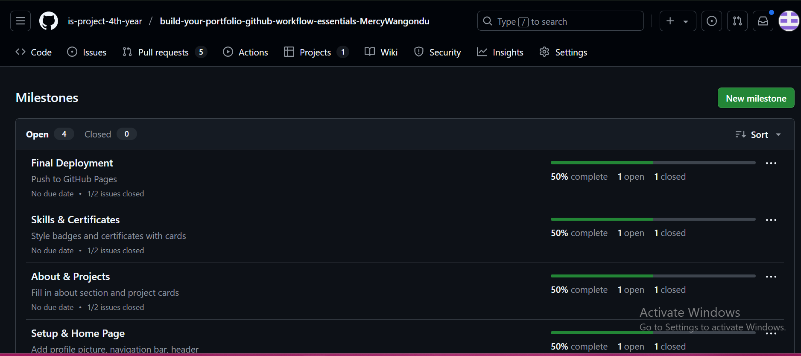
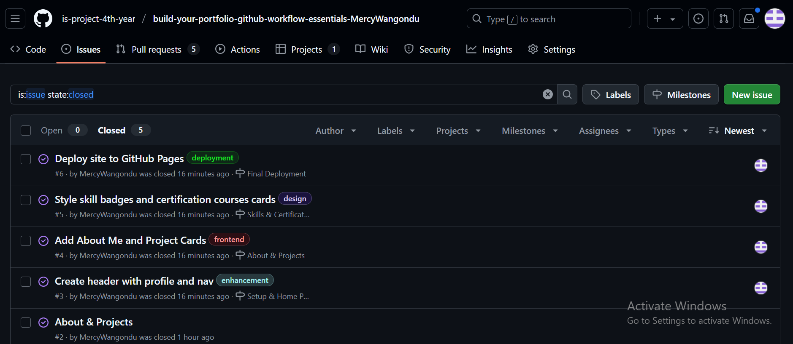
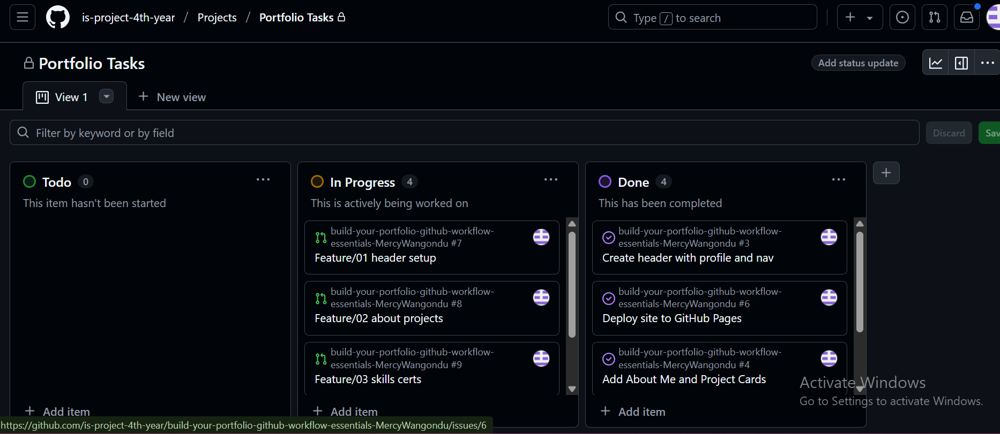
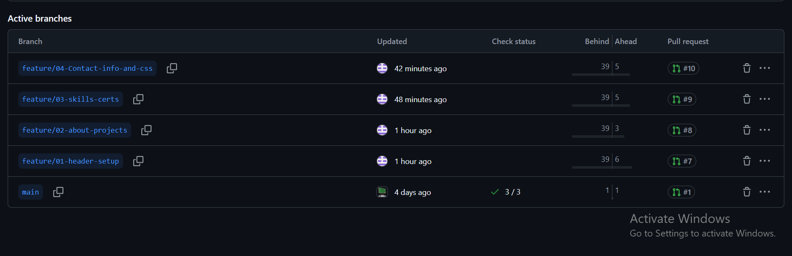
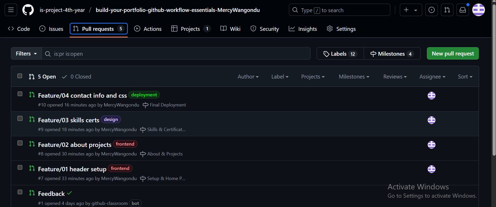
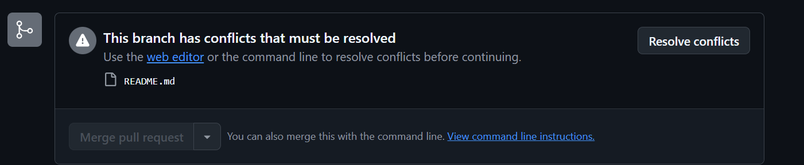

# 📌 Personal Portfolio Documentation – Mercy Wangondu

---

## 1. Student Details

**Full Name:** Wangondu Mercy Mumbi  
**GitHub Username:** MercyWangondu  
**Email:** mercy.wangondu@strathmore.edu

---

## 2. Deployed Portfolio Link

**GitHub Pages URL:**  
[https://is-project-4th-year.github.io/build-your-portfolio-github-workflow-essentials-MercyWangondu/](https://is-project-4th-year.github.io/build-your-portfolio-github-workflow-essentials-MercyWangondu/)

---

## 3. Learnings from the Git Crash Program

### 🔀 Branching  
Branching helped me separate features and prevent conflicts when working on different parts of the site, such as the header, about section, skills, and deployment setup. By working on each task in its own branch (e.g., `feature/01-header`, `feature/02-about-projects`), I was able to test, commit, and merge independently without interfering with the main codebase.

### ✅ Issues & Milestones  
Using GitHub Issues allowed me to clearly define each task, such as “Add About Section” or “Style Certificate Cards,” and then track their progress. Linking issues to Milestones gave me a timeline and grouped related tasks (e.g., all certificate-related work under the “Skills & Certificates” milestone), making the development process feel organized and intentional.

### 📋 GitHub Project Boards  
The GitHub project board visually mapped my entire portfolio workflow from planning to completion. I created a board with “To Do,” “In Progress,” and “Done” columns and added all my issues as cards. As I worked on each feature, I could move the card to reflect the status — just like using Trello or a kanban board. This helped me stay focused and motivated, especially seeing progress as tasks moved to “Done.” It also allowed quick tracking of what was pending, in progress, or complete without having to dig into commits.

### ⚔️ Merge Conflict Resolution  
By editing the same line of code in two branches (`feature/email-red` and `feature/email-blue`), I intentionally triggered a merge conflict. This helped me understand how conflicts occur and how to resolve them. I used GitHub’s built-in conflict resolution tool to manually select and merge the correct version of the conflicting code. This practical experience showed me how to collaborate effectively on team projects where code changes might overlap.

---

## 4. Screenshots of Key GitHub Features

### A. Milestones
  
**1. Setup & Home Page:** Built the landing section with profile image, navigation bar, and header content.

**2. About & Projects:** Added the About Me section and implemented responsive project cards with descriptions and hover effects.

**3. Skills & Certificates:** Styled skill badges as interactive elements and displayed certificates in modern card format.

**4. Final Deployment:** Prepared the site for live deployment via GitHub Pages and simulated a merge conflict for learning purposes.

*
### B.Issues Created
  
**1. Create header with profile and nav**

**Task:** Build and style the header section of the site, including profile image and navigation links.
**Milestone:** Setup & Home Page

**2. Add About Me and Project Cards**

**Task:** Add content for the About section and build out the project display cards.

**Milestone:** About & Projects

**3. Style skill badges and cert cards**

**Task:** Create animated skill badges and visually appealing certificate cards.

**Milestone:** Skills & Certificates

**4. Deploy site to GitHub Pages**

**Task:** Push final changes to GitHub and configure Pages deployment. Also included merge conflict simulation.

**Milestone:** Final Deployment

### C. Project Board  
  

### C. Branching  
  
**1. main:** The production branch containing final deployed code.

**2. feature/01-header:** Developed the header section with profile image and nav bar.

**3. feature/02-about-projects:** Added and styled the About Me section and project cards.

**4. feature/03-skills-certs:** Created and styled skill badges and certificate card layouts.

**5. feature/04-deployment:** Final touches for GitHub Pages setup and conflict preparation.

**6. feature/email-red:** Set email color to red in the contact section for merge conflict testing.

**7. feature/email-blue:** Set the same email line to blue to simulate a conflict with email-red.

### D. Pull Requests  
  
**1. feat(header):** added profile picture and nav bar: Pulled from feature/01-header to main. Implemented header UI and navigation links. ✅ Merged

**2. feat(about):**added about me and projects section: Pulled from feature/02-about-projects. Created and styled content cards. ✅ Merged

**3. feat(skills):** added skill badges and certificate cards: Pulled from feature/03-skills-certs. Interactive and styled cards. ✅ Merged

**4. chore(deploy):** prepared project for deployment: Pulled from feature/04-deployment. Final cleanup and GitHub Pages config. ✅ Merged

### E. Merge Conflict Resolution  
  

---

